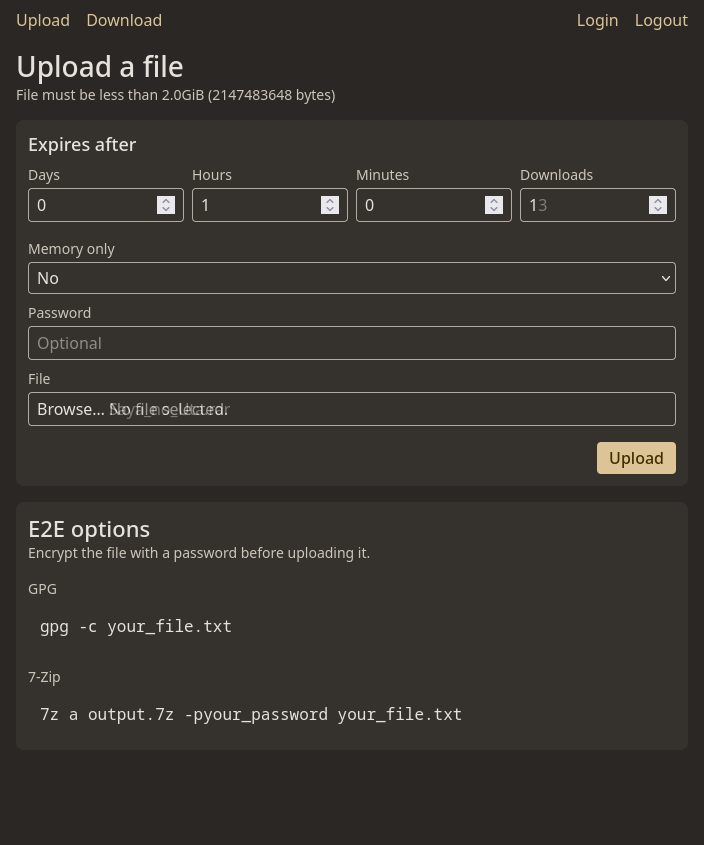
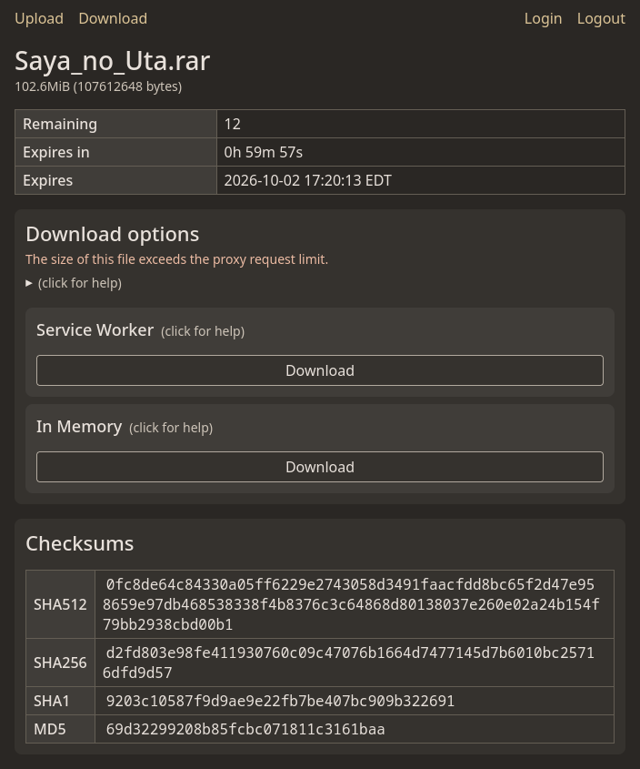

Ki is a simple, self-hosted temporary file sharing service.

Registered users upload files and get a link to share. Anyone with the link can download the file, optionally with a password. Each file is deleted automatically after a set number of downloads or a set amount of time, whichever comes first.

| Upload | Download |
|--------|----------|
|  |  |

## Features

- [x] File uploads and downloads
- [x] File checksums (`SHA512`, `SHA256`, `SHA1`, `MD5`)
- [x] File expiration by download count and time limit
- [x] Configurable upload size limit (2 GB by default)
- [x] Chunked uploads/downloads to bypass proxy size limits
- [x] Works without Javascript *(except for files larger than the proxy request limit)*
- [x] Password-protected downloads
- [x] Server-side encryption of files and metadata
- [x] Memory-only uploads, whose metadata is never written to disk
- [x] Downloads from a terminal with `curl` or `wget`
- [x] CloudFlare MitM warning
- [x] Support for SSL without a reverse proxy
- [ ] End-to-end encryption *(currently supported through the GPG / 7-Zip commands shown on the upload page)*

## Usage

Before starting the server, create one or more users who are allowed to upload files.
Usernames can be at most 10 characters, and passwords at most 32.
```sh
ki registry create \
  -u minno -p minno_password \
  -u bob -p bob_password

# Outputs ./users.json
```

Then start the server:
```sh
ki run --master-secret your-master-secret
```

Then open http://localhost:9070

The master secret must be at least 8 characters. It encrypts the file database and all the files, so keep it safe.

### Uploading

If the file is larger than the configured proxy limit, it will be automatically chunked while uploading.

Before uploading you can set a couple options:
- **Expires after**: a time (days, hours, minutes) and a number of downloads. The file is deleted when either is reached.
- **Memory only**: the file's metadata is kept in memory instead of the database. The file can't be recovered if the server restarts or crashes.
- **Password**: if set, the password is needed to download the file, and is used to encrypt it.

### Downloading

Depending on the size of the file (i.e. the file is within the set proxy limit), and the browser of the downloader, there are a few options for downloading files.

| Option | Within the proxy limit | Over the proxy limit | Requirements | Notes |
|--------|:----------------------:|:--------------------:|--------------|-------|
| Direct Download | Yes | No | Any browser, works without JavaScript | Direct download |
| curl / wget | Yes | No | A terminal | Direct download via commandline |
| [Picker API](https://developer.mozilla.org/en-US/docs/Web/API/Window/showSaveFilePicker) | Yes | Yes | A supported browser. See [Supported browsers](https://developer.mozilla.org/en-US/docs/Web/API/Window/showSaveFilePicker#browser_compatibility) | Writes straight to disk as it downloads. This is the best option for files larger than the proxy limit. Progress is only shown on the page |
| Service Worker | Yes | Yes | Most browsers | The service worker intercepts the download request and answers it with a stream, making it appear (and function) as a regular direct download. The file is fetched in chunks and written to the stream in order. May be cut short if the page is closed, or the browser stops the service worker |
| In Memory | Yes | Yes | Any browser with JavaScript | The whole file has to fit in memory, so large files can crash the tab. Nothing is saved until the download has finished |

The download options only appear if the browser supports them.

## Configuration

`ki run` takes these flags, which can also be set with environment variables:

| Flag | Environment variable | Default | Description |
|------|----------------------|---------|-------------|
| `--bind` | `KI_BIND_ADDR` | `0.0.0.0` | The bind address |
| `--port` | `KI_PORT` | `9070` | The port number |
| `--registry` | `KI_USER_REGISTRY_PATH` | `./users.json` | The user registry file |
| `--file-dir` | `KI_FILE_DIR` | `./ki_files` | Where uploaded files and the database are stored |
| `--master-secret` | `KI_MASTER_SECRET` | | The secret used to encrypt the database. Required |
| `--max-upload-size` | `KI_MAX_UPLOAD_SIZE` | 2 GB | The max size of an uploaded file, in bytes |
| `--max-upload-chunk-size` | `KI_MAX_UPLOAD_CHUNK_SIZE` | 50 MB | The max size of one request, in bytes. Larger files are chunked. Set this below your proxy's limit (e.g. Cloudflare's 100 MB on the free tier, or nginx's 1 MB default) |
| `--trusted-proxy` | `KI_TRUSTED_PROXIES` | | Subnets of trusted reverse proxies |
| `--tls-cert` | `KI_TLS_CERT` | | Serve HTTPS directly. Given `path/cert`, both `path/cert.crt` and `path/cert.key` must exist |

Per-logger log levels can be set in `log-config.json` in the working directory.

### Storage

Everything is stored in the `--file-dir` directory:
- `data.db`: the database which holds file metadata.
- `ki_*`: the encrypted uploaded files.
- `mem/`: the encrypted files of memory-only uploads. This is cleared on startup, since their metadata doesn't survive a restart.

## Security

Things to be aware of:
- With the master secret, the server can decrypt every file uploaded without a password.
- Files uploaded with a password can't be decrypted from what is stored, since the password is only kept as a bcrypt hash. The server still sees the password when the file is uploaded and downloaded, so a modified server could save it. For files the server should never be able to read, encrypt them before uploading.
- The encryption of file contents is not authenticated. To be sure a download wasn't tampered with, compare its checksum with the one the uploader saw.
- A file's name, size and checksums are shown on its download page to anyone with the link, even if it has a password.

## Docker

Images are published to `ghcr.io/minnowo/ki`, or you can build one yourself. The Docker build builds the UI too, so it only needs Docker.

```sh
docker pull ghcr.io/minnowo/ki:main && docker tag ghcr.io/minnowo/ki:main ki
# or
docker build -t ki .

docker run -p 9070:9070 \
  -v $(pwd)/ki_files:/ki_files \
  -v $(pwd)/users.json:/users.json \
  ki run --master-secret your-master-secret --file-dir /ki_files --registry /users.json
```

The image runs as UID 1000:1000, so the mounted `ki_files` directory must be writable by that user.

## Building

Requirements:
- Go 1.25 or later
- [templ](https://templ.guide) and goimports *(installed by `make download-tools`)*
- [Tailwind CSS](https://tailwindcss.com) v4 standalone CLI, as `tailwind` on your `PATH`
- Docker, with an `npm-dev:latest` image that has npm, used to build the TypeScript client
- Make *(optional if you read the Makefile and do the steps manually)*

Build the project:
```sh
make download-tools generate build-site
```

This outputs a static binary, `./main.o`.

### Development

```sh
make run          # format, generate, and run with debug logging
make test         # format, generate, and run the tests
make test-race    # same, with the race detector
```
